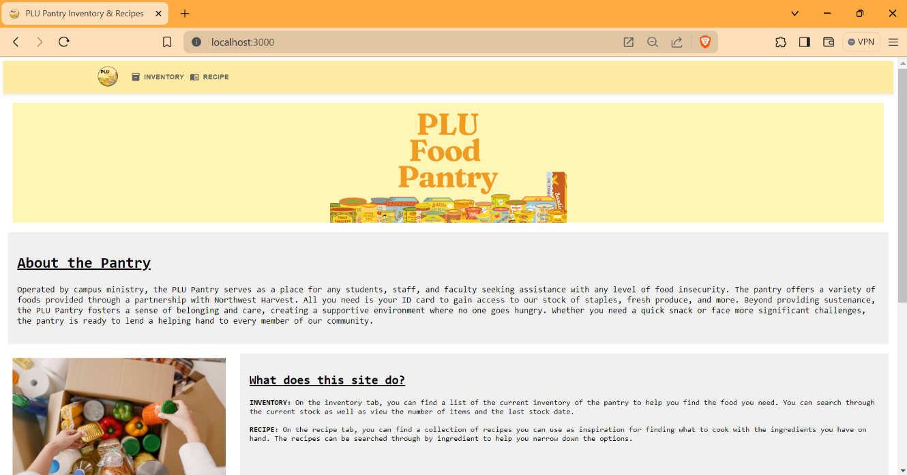

# Ashley's Portfolio

## Projects

### PLU Food Pantry Inventory System
**Duration:** 09/2023 - Present

**Description:**
Developed a user-friendly inventory management web application for the Pacific Lutheran University Food Pantry, aimed at enabling easy monitoring of item categorization and ensuring seamless updates for pantry operations. Actively refining and enhancing the application through ongoing development efforts.

**Key Contributions:**
- Developed a user-friendly interface using React and MaterialUI for easy inventory management.
- Integrated MySQL Database for secure and reliable inventory data management.

**Responsibilities:**
- Designed and implemented the front-end interface using React.js, ensuring a smooth and intuitive user experience.
- Developed back-end functionalities using Node.js to handle inventory management operations and interact with the MySQL database.
- Collaborated with PLU Pantry management to gather requirements and prioritize features for ongoing development.
- Conducted testing and debugging to ensure the application's reliability and performance.

[Link to Git Repo](https://github.com/ashleyakamine/pantry-stack)

### Analyzing Scoring Efficiency: A Multiple Regression Model for Women's Basketball
**Duration:** 09/2023 - 12/2023

**Description:**
Investigated the factors influencing scoring efficiency for NCAA Division I women's basketball teams. Utilizing linear regression analysis, I examined the relationship between variables such as minutes played, player position, and field goal percentage to understand their impact on scoring efficiency.

**Key Contributions:**
- Administered linear regression analysis to assess the impact of key variables on scoring efficiency, ensuring robust statistical analysis.
- Conducted statistical interpretation of results to validate findings and draw meaningful conclusions regarding the impact of variables on scoring efficiency.

**Responsibilities:**
- Collected and cleaned data from various sources, including NCAA databases and team statistics, to build a comprehensive dataset for analysis.
- Designed and implemented the regression model using statistical software (e.g., R or Python) to analyze the relationship between independent variables and scoring efficiency.
- Conducted hypothesis testing and diagnostic checks to ensure the validity and reliability of the regression model.
- Communicated findings through reports and presentations, providing actionable insights for coaches and team management to improve scoring efficiency strategies.

[View Project Report](./assets/final_project_aa.pdf)

### Data Analysis for American Bar Association (ABA): Pro Bono Legal Advice Site

**Description:**
Conducted comprehensive data analysis in the 2023 PLU DataFest competition to provide strategic advice to the American Bar Association (ABA) on optimizing the availability of legal experts for their pro bono legal advice site. The project aimed to enhance the efficiency and effectiveness of matching legal experts with individuals seeking pro bono legal assistance.

**Key Contributions:**
- Cleaned and analyzed data on legal expertise, geographic location, availability, and specialization of legal professionals affiliated with the ABA.
- Employed data visualization techniques to create insightful graphs illustrating the diverse demographics of clients seeking pro bono legal assistance.

**Impact:**
The insights and recommendations provided through the data analysis have the potential to significantly improve the accessibility and quality of pro bono legal assistance offered by the American Bar Association, ultimately benefiting individuals in need of legal support across various communities.

**Award:**
- **Outstanding Data Analysis Award**: Recognized by the PLU Datafest judges for the best visualization of the data.

[View Project Report](./assets/DataDynamoSlides.pdf)

